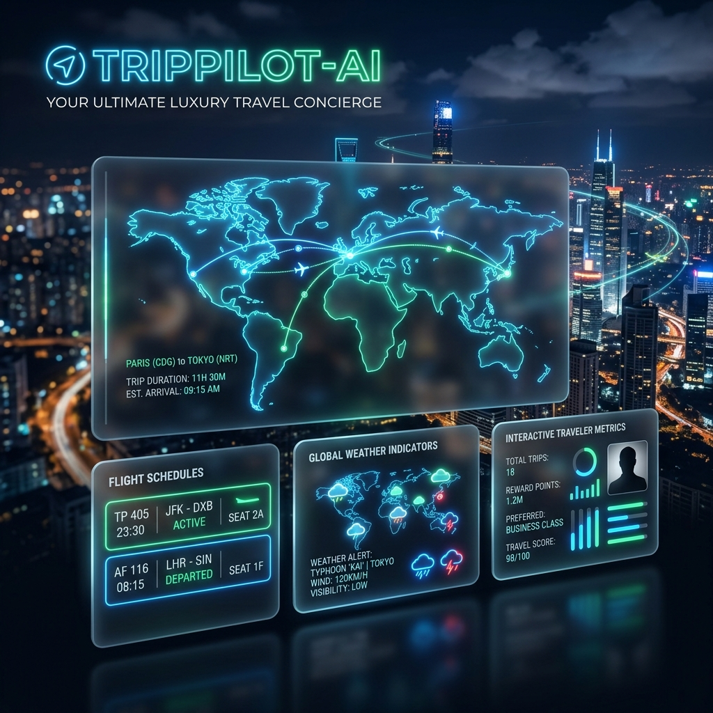
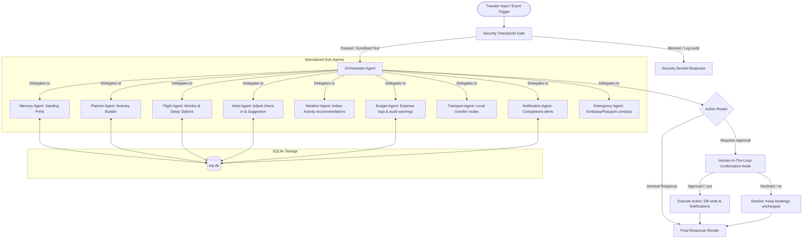
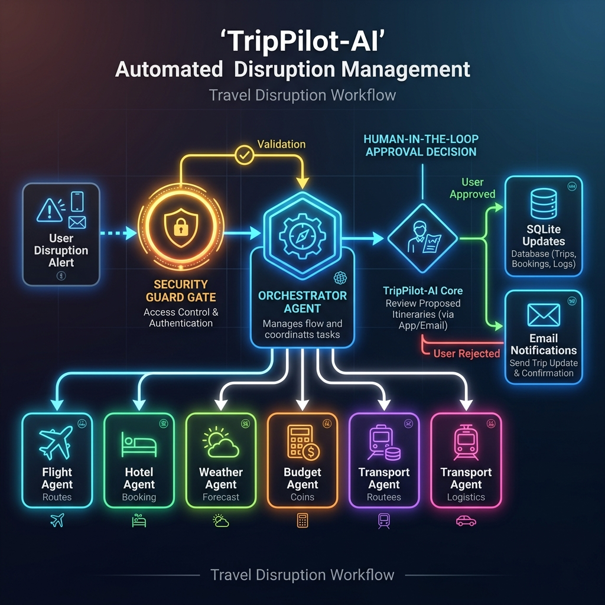
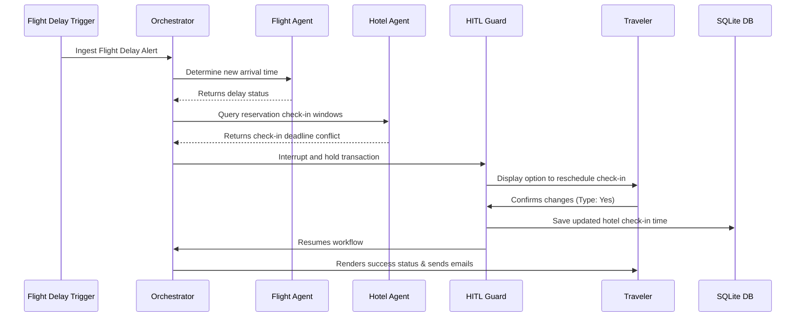
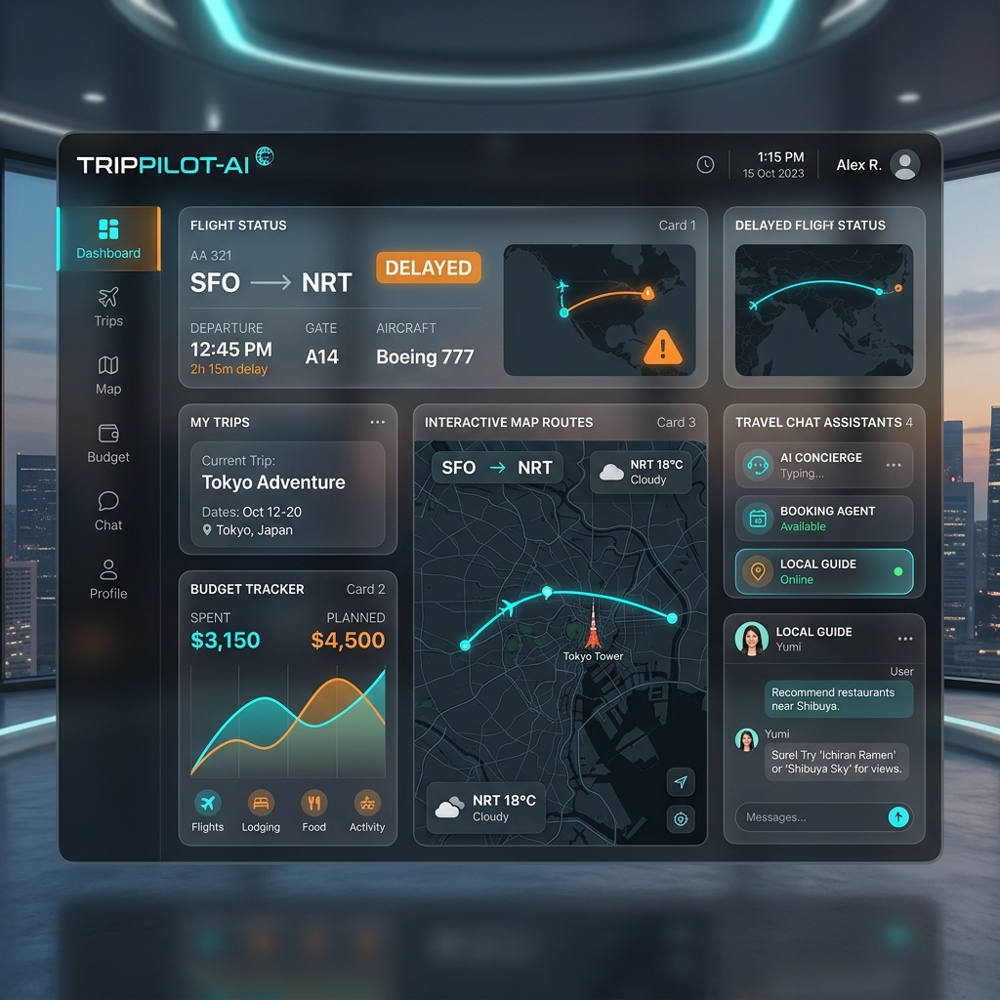

# ✈️ TripPilot-AI: Proactive Travel Concierge AI



> **"Your AI Travel Companion That Doesn't Just Plan Trips — It Travels With You."**

TripPilot-AI is a portfolio-grade, event-driven, multi-agent proactive travel concierge that continuously monitors active travel statuses and coordinates specialized sub-agents to solve disruptions (flight delays, severe weather warnings, budget thresholds) before the traveler even asks.

Built using the **Google Agent Development Kit (ADK) 2.0**, SQLite, Streamlit, and FastAPI, this project showcases how complex, asynchronous multi-agent coordination with built-in security auditing and Human-in-the-loop (HITL) gates can solve real-world problems.

---

## 🎯 About the Project & Core Functions

Most travel assistants are purely reactive: they wait for you to ask "What is my flight status?" or "Is it going to rain?". TripPilot-AI is **proactive**. It monitors active flight schedules, weather forecasts, and expense budgets, then automatically coordinates adjustments. 

### Key Functions
1. **🔒 Dual-Layer Security Checkpoint:**
   * **PII Redaction Filter:** Automatically scans user prompts and inputs, redacting credit cards, passport numbers, email addresses, and phone numbers with replacement tags (e.g., `[CREDIT_CARD_REDACTED]`).
   * **Injection Shield:** Automatically detects and blocks prompt injection/bypass scripts like "ignore previous instructions", immediately routing execution to a safe security audit node.
2. **🧠 Smart Traveler Memory:**
   * Integrates traveler preferences (preferred airline alliances, hotel chains, dietary constraints, seat preferences) and feeds them directly to the planning agent to create customized itineraries.
3. **🎭 Proactive Disruption Management:**
   * Automatically adapts itineraries based on real-time triggers:
     * **Flight Delays:** Detects arrival delays, recalculates timeline, shifts hotel check-in time windows, and notifies travel companions.
     * **Severe Weather Warnings:** Replaces outdoor excursions with curated indoor attractions (museums, art galleries) if rain or storm warnings are detected.
     * **Budget Warnings:** Flags when total expenses reach 90% of the trip budget, proposing low-cost transit or local dining alternatives.
4. **🛑 Human-in-the-Loop (HITL) Gate:**
   * Before committing modifications to booking databases (like changing hotel check-in times or itinerary items), the orchestrator triggers an interrupt to request traveler approval.
5. **🔌 Unified FastMCP Tools:**
   * Exposes standard model-context tools including Google Calendar event dispatch, Google Maps routing, Weather forecast fetches, Email dispatch, and local filesystem packet exporting.

---

## 🏗️ Multi-Agent Coordination & The 9 Specialized Sub-Agents

All user queries or event triggers flow through a central security gate into the **Orchestrator Agent**, which is built on a Google ADK Workflow graph. The orchestrator delegates tasks to **9 specialized sub-agents** configured as agent tools.





### The 9 Specialized Agents in detail:
1. **Memory Agent (`agents/memory_agent.py`):** Saves and retrieves user travel profiles, preferred seating, hotel choices, and dietary plans to seed itineraries.
2. **Planner Agent (`agents/planner_agent.py`):** Creates, reads, updates, and deletes itineraries using SQLite databases.
3. **Flight Agent (`agents/flight_agent.py`):** Tracks flight updates, delays, gating changes, and coordinates replacement schedules.
4. **Hotel Agent (`agents/hotel_agent.py`):** Checks reservation details and handles requests to reschedule check-in times.
5. **Weather Agent (`agents/weather_agent.py`):** Fetches real-time weather information and suggests indoor activity alternatives.
6. **Budget Agent (`agents/budget_agent.py`):** Logs expenses and alerts users when budgets approach capacity.
7. **Transport Agent (`agents/transport_agent.py`):** Suggests local transport options, public transit schedules, and taxi routing.
8. **Notification Agent (`agents/notification_agent.py`):** Handles email composition and messages dispatched to companions.
9. **Emergency Agent (`agents/emergency_agent.py`):** Provides emergency contact details, embassy locations, and passport recovery procedures.

---

## 🔄 System Workflows

TripPilot-AI processes system alerts and user requests through distinct, event-driven pipelines.

### 1. Proactive Flight Delay Workflow
When a flight delay is reported to the backend:
1. **Trigger:** A flight delay event is ingested.
2. **Analysis:** The `Flight Agent` determines the updated arrival time.
3. **Implication:** The `Hotel Agent` checks the reservation check-in deadline. If the delay pushes arrival past this deadline, the orchestrator flags a conflict.
4. **HITL Interruption:** The workflow pauses, and a prompt is sent to the user: *"Flight is delayed. Reschedule hotel check-in to 8:30 PM?"*.
5. **Execution:** On approval, SQLite is updated, and the `Notification Agent` triggers an email update to companions.



### 2. Proactive Severe Weather Activity Swapping
When a rain forecast or severe weather alert triggers:
1. **Weather Fetch:** The `Weather Agent` checks local forecasts for scheduled outdoor activities.
2. **Itinerary Adjustment:** If rain is detected, it suggests indoor swaps (e.g. replacing a park walk with a museum visit).
3. **HITL Request:** Request user permission to swap items on the itinerary list.
4. **Save & Notify:** Updates the DB and sends confirmation logs.

---

## 🛠️ Developer Cockpit Dashboard Mockup

Below is a high-fidelity visual preview of the **TripPilot-AI Cockpit Dashboard**, showcasing the real-time concierge status, active itinerary, flight tracking, weather dashboard, budget monitors, and security logs.



---

## 🧪 CI/CD Test & Build Workflow

We maintain code reliability using a GitHub Actions continuous integration pipeline. The workflow runs on every push or pull request to the `main` branch.

### GitHub Actions Pipeline Configuration (`.github/workflows/ci.yml`)
The workflow utilizes Astral `uv` to speed up environment builds and test runs:
* **Operating System:** `ubuntu-latest`
* **Python Version:** `3.11`
* **Package Manager:** Astral `uv`
* **Test Command:** `uv run pytest tests/unit/test_travel_concierge.py`

When code is pushed, the system executes unit tests covering the **SQLite Database Helper**, **PII scrubbing matching rules**, and **Prompt Injection blocked terms**.

---

## 📂 Project Structure

```
trip-pilot-ai/
├── .github/
│   └── workflows/
│       └── ci.yml      # CI/CD test configuration
├── agents/             # The 9 specialized sub-agents
│   ├── planner_agent.py
│   ├── flight_agent.py
│   ├── hotel_agent.py
│   ├── weather_agent.py
│   ├── transport_agent.py
│   ├── budget_agent.py
│   ├── notification_agent.py
│   ├── emergency_agent.py
│   └── memory_agent.py
├── app/                # Main workflow and API entrypoints
│   ├── agent.py               # Central orchestrator workflow graph
│   ├── config.py              # Universal project configurations
│   ├── mcp_server.py          # Unified FastMCP server
│   └── fast_api_app.py        # FastAPI Backend engine
├── assets/             # Images, banners, and mockups
│   ├── cover_page_banner.png
│   ├── workflow_diagram.png
│   └── dashboard_mockup.png
├── database/           # SQLite Database schemas and CRUD operations
│   └── db_helper.py
├── frontend/           # Streamlit Web app cockpit and Simulator
│   └── dashboard.py
├── models/             # Shared Pydantic data schemas
│   └── travel_schemas.py
├── tests/              # Pytest automated test suites
├── Dockerfile          # Multi-stage Docker config
├── docker-compose.yml  # Local stack deploy (Backend + Streamlit UI)
└── pyproject.toml      # Dependency configurations
```

---

## 🚀 Getting Started

# Youtube Demo
 
[

 
### 1. Prerequisites
Ensure you have `uv` installed (Python package manager):
```bash
# Windows (PowerShell)
irm https://astral.sh/uv/install.ps1 | iex
```

### 2. Environment Setup
Create a `.env` file in the root directory:
```env
GOOGLE_API_KEY=your_gemini_api_key
GEMINI_MODEL=gemini-2.5-flash
```

### 3. Install Dependencies
```bash
uv sync
```

### 4. Run the Automated Tests
```bash
uv run pytest tests/unit/test_travel_concierge.py
```

### 5. Running the Application

#### Using Docker Compose:
```bash
docker-compose up --build
```
* **Streamlit Dashboard:** Open `http://localhost:8501`
* **FastAPI Backend:** Access the API docs at `http://localhost:8000/docs`

#### Running Locally (Without Docker):
```bash
# Start FastAPI backend
uv run uvicorn app.fast_api_app:app --host 127.0.0.1 --port 8000

# Start Streamlit frontend
uv run streamlit run frontend/dashboard.py --server.port 8501 --server.address 127.0.0.1
```
